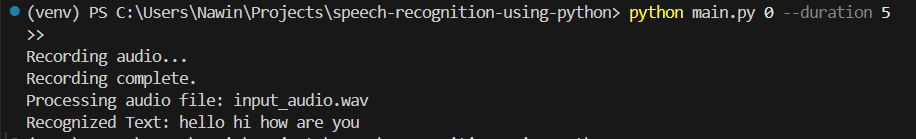

# Speech Recognition using Python

This project implements a simple speech recognition system that can either record audio from the microphone or process an existing audio file, reduce noise, enhance the audio quality, and recognize speech using the Google Web Speech API.

## Usage

1. Install the required dependencies:

    ```bash
    pip install -r requirements.txt
    ```

2. To run the program with microphone input (e.g., 5 seconds of audio):

    ```bash
    python main.py 0 --duration 5
    ```

3. To run the program with an audio file:

    ```bash
    python main.py path_to_audio_file.wav
    ```

## Code Explanation

- **`record_audio(duration, fs)`**: 
    - Records audio using the `sounddevice` library for the specified duration (in seconds) and sample rate (`fs`).
    - Returns the recorded audio as a single-channel array.

- **`enhance_audio(input_audio, sample_rate)`**: 
    - Uses the `noisereduce` library to reduce background noise from the input audio.
    - Applies a chain of audio effects using the `Pedalboard` library to enhance the audio quality:
    
      **Pedalboard Audio Effects**:
      - **Noise Gate**: Suppresses audio below a certain volume threshold (`-30 dB` in this case), helping to eliminate quiet background noise.
      - **Compressor**: Reduces the dynamic range by lowering the volume of the loud parts of the audio, making the overall volume more consistent. The threshold is set at `-16 dB` with a compression ratio of `2.5:1`.
      - **Low-Shelf Filter**: Boosts low frequencies (below `400 Hz`) by `10 dB`, enhancing the lower range of the audio.
      - **Gain**: Increases the overall volume of the audio by `10 dB` after applying other effects.

- **`process_audio_file(file_path)`**: 
    - Loads the audio from the specified file path using the `pedalboard.io.AudioFile` class and resamples it to the required sample rate.
    - Returns the audio data for further processing.

- **`main(input_source, duration)`**: 
    - Handles both microphone input (if `0` is provided) and file input (if a file path is provided).
    - The function records or loads the audio, applies noise reduction and enhancement, and then uses the Google Web Speech API to recognize the speech and print the recognized text.



